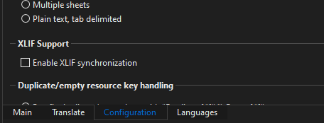

## Xliff

ResX Resource Manager supports synchronisation between `ResX` and `Xliff` resource files.

This can be useful if your translation service accepts `Xliff` files as a translation source.

You can also complement or replace the [Multilingua lApp Toolkit (MAT)](https://marketplace.visualstudio.com/items?itemName=MultilingualAppToolkit.MultilingualAppToolkit-18308)

### Configuration

You have to enable this feature in the configuration tab of RXRM:

### How it works

- When this feature is enabled, synchronisation runs only after you have opened the ResX Resource Manager window at least once.
 
- When you open a solution, translated strings of all `ResX` files are updated from their corresponding `Xliff` value.

- When you edit a localized string, both `ResX` and `Xliff` values are updated. The translation state of the `Xliff` entry is updated according to the change.

- When you update a string in an `Xliff` file, using an external editor, the corresponding `ResX` entry is updated.